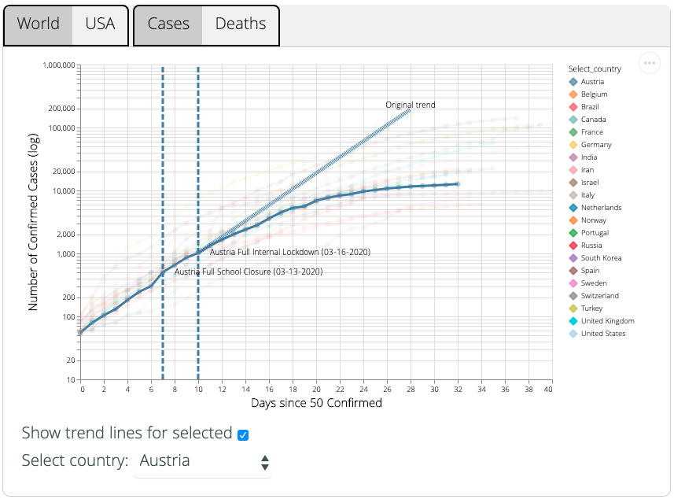

# [covidvis](https://covidvis.berkeley.edu)

[](https://covidvis.berkeley.edu)

Building the Charts
-------------------
```
pip install -r requirements.txt
./scripts/build-charts.py
```

Now the charts have been added to the website. (Try
doing `git status` after making a change to the charts.)

Building the Website
--------------------

Make sure that you have Ruby version >= 2.4. Building the website requires ruby
and bundler. To grab website dependencies, do the following from the `website`
directory:

```
gem install bundler
bundle install
```

Now it should be possible to preview changes using jekyll (from `website`
subdirectory):

`bundle exec jekyll serve`

To build without previewing execute the following (again, from `website`
subdirectory):

`bundle exec jekyll build`

Or simply run the convenience script (from the root directory):

`./scripts/build-web.sh`

Deploying
---------

Deploying to github pages consists of copying the contents of `website/_site`
into `covidvis.github.io`, commiting, and pushing. The command for this is
as follows:

`./scripts/deploy-web.sh`

`make depoy` also works.

* NOTE: this script assumes that the repo `../covidvis.github.io` exists in the
  parent directory.

Staging
---------

Deploying to the staging repo consists of copying the contents of
`website/_site` into the `gh-pages` of the `covidvis-staging` repository,
followed by commiting and pushing. The command for this is as follows:

`./scripts/deploy-web.sh ../covidvis-staging gh-pages`

`make stage` also works.

* NOTE: this script assumes that the repo `../covidvis-staging` exists in the
  parent directory. It may be necessary to first clone and check out the
  `gh-pages` branch. The following commands should be run from the parent
  directory:

```
git clone git@github.com:covidvis/covidvis-staging
cd covidvis-staging
git checkout gh-pages
```


Makefile for End to End Building and Deploying
----------------------------------------------

To execute all build steps end-to-end, simply type `make`.

To stage: `make stage` (just a wrapper around `scripts/deploy-web.sh`)
To deploy: `make deploy` (another wrapper around `scripts/deploy-web.sh`)

* NOTE: the deploy script only pushes the built website. To save your edits,
  you still need to commit / push changes made in the covid19-vis repo.


Editing the Website
-------------------
`website/index.markdown` contains the actual content.
`website/assets/css/main.scss` contains styling.
Edit `website/_includes/head.html` for anything that needs to go between `<head>` and `</head>` tags.
